Multiple Linear Regression to Reduce Crime
================
Noah Randolph, Asha Anju, Anamika Sinha
8/20/2017

Introduction
============

Societies have long been interested in studying crime rate. Factors that influence crime rate have been debated and researched with data in many different studies. Although specific factors may have varying importance for an individual city or area, there are some factors that have broad acceptance. Economic conditions like poverty and unemployment rate are considered to increase crime. Demographic factors like density and younger populations are also associated with high crime rates. Lastly, the function of criminal justice systems is to deter crime. Therefore, they also are of key interest.

We are tasked with deciding on policy recommendations for a political campaign. Given a dataset on county crime rates, along with several related variables, we will combine practical knowledge with multiple linear regression techniques to determine potential ways to reduce crime. We will perform an exploratory data analysis to determine the key variables to include in our regression models. We will then determine the most accurate and parsimonious model that will lead us to make sound policy recommmendations.

Load Data
=========

We first load the data and note any anomalies, such as missing values, top-coded or bottom-coded variables, or not-applicable values.

``` r
library(sandwich)
library(lmtest)
```

    ## Loading required package: zoo

    ## 
    ## Attaching package: 'zoo'

    ## The following objects are masked from 'package:base':
    ## 
    ##     as.Date, as.Date.numeric

``` r
library(car)
library(stargazer)
```

    ## 
    ## Please cite as:

    ##  Hlavac, Marek (2015). stargazer: Well-Formatted Regression and Summary Statistics Tables.

    ##  R package version 5.2. http://CRAN.R-project.org/package=stargazer

``` r
library(MASS)
CrDat = read.csv("crime_v2.csv")
attach(CrDat)
```

Exploratory Data Analysis
=========================

We begin with a summary of the data.

``` r
summary(CrDat)
```

    ##        X             county           year        crime         
    ##  Min.   : 1.00   Min.   :  1.0   Min.   :88   Min.   :0.005533  
    ##  1st Qu.:23.25   1st Qu.: 51.5   1st Qu.:88   1st Qu.:0.020604  
    ##  Median :45.50   Median :103.0   Median :88   Median :0.030002  
    ##  Mean   :45.50   Mean   :100.6   Mean   :88   Mean   :0.033510  
    ##  3rd Qu.:67.75   3rd Qu.:150.5   3rd Qu.:88   3rd Qu.:0.040249  
    ##  Max.   :90.00   Max.   :197.0   Max.   :88   Max.   :0.098966  
    ##     probarr          probsen           probconv           avgsen      
    ##  Min.   :0.1500   Min.   :0.09277   Min.   :0.06838   Min.   : 5.380  
    ##  1st Qu.:0.3642   1st Qu.:0.20495   1st Qu.:0.34422   1st Qu.: 7.375  
    ##  Median :0.4222   Median :0.27146   Median :0.45170   Median : 9.110  
    ##  Mean   :0.4106   Mean   :0.29524   Mean   :0.55086   Mean   : 9.689  
    ##  3rd Qu.:0.4576   3rd Qu.:0.34487   3rd Qu.:0.58513   3rd Qu.:11.465  
    ##  Max.   :0.6000   Max.   :1.09091   Max.   :2.12121   Max.   :20.700  
    ##      police             density            tax              west       
    ##  Min.   :0.0007459   Min.   :0.2034   Min.   : 25.69   Min.   :0.0000  
    ##  1st Qu.:0.0012378   1st Qu.:0.5472   1st Qu.: 30.73   1st Qu.:0.0000  
    ##  Median :0.0014897   Median :0.9792   Median : 34.92   Median :0.0000  
    ##  Mean   :0.0017080   Mean   :1.4379   Mean   : 38.16   Mean   :0.3778  
    ##  3rd Qu.:0.0018856   3rd Qu.:1.5693   3rd Qu.: 41.01   3rd Qu.:1.0000  
    ##  Max.   :0.0090543   Max.   :8.8277   Max.   :119.76   Max.   :1.0000  
    ##     central           urban             pctmin          wagecon     
    ##  Min.   :0.0000   Min.   :0.00000   Min.   : 1.284   Min.   :193.6  
    ##  1st Qu.:0.0000   1st Qu.:0.00000   1st Qu.:10.024   1st Qu.:250.8  
    ##  Median :0.0000   Median :0.00000   Median :24.852   Median :281.2  
    ##  Mean   :0.2333   Mean   :0.08889   Mean   :25.713   Mean   :285.4  
    ##  3rd Qu.:0.0000   3rd Qu.:0.00000   3rd Qu.:38.183   3rd Qu.:315.0  
    ##  Max.   :1.0000   Max.   :1.00000   Max.   :64.348   Max.   :436.8  
    ##     wagetuc         wagetrd         wagefir         wageser      
    ##  Min.   :187.6   Min.   :154.2   Min.   :170.9   Min.   : 133.0  
    ##  1st Qu.:374.3   1st Qu.:190.7   1st Qu.:285.6   1st Qu.: 229.3  
    ##  Median :404.8   Median :203.0   Median :317.1   Median : 253.1  
    ##  Mean   :410.9   Mean   :210.9   Mean   :321.6   Mean   : 275.3  
    ##  3rd Qu.:440.7   3rd Qu.:224.3   3rd Qu.:342.6   3rd Qu.: 277.6  
    ##  Max.   :613.2   Max.   :354.7   Max.   :509.5   Max.   :2177.1  
    ##     wagemfg         wagefed         wagesta         wageloc     
    ##  Min.   :157.4   Min.   :326.1   Min.   :258.3   Min.   :239.2  
    ##  1st Qu.:288.6   1st Qu.:398.8   1st Qu.:329.3   1st Qu.:297.2  
    ##  Median :321.1   Median :448.9   Median :358.4   Median :307.6  
    ##  Mean   :336.0   Mean   :442.6   Mean   :357.7   Mean   :312.3  
    ##  3rd Qu.:359.9   3rd Qu.:478.3   3rd Qu.:383.2   3rd Qu.:328.8  
    ##  Max.   :646.9   Max.   :598.0   Max.   :499.6   Max.   :388.1  
    ##       mix              ymale        
    ##  Min.   :0.01961   Min.   :0.06216  
    ##  1st Qu.:0.08060   1st Qu.:0.07437  
    ##  Median :0.10095   Median :0.07770  
    ##  Mean   :0.12905   Mean   :0.08403  
    ##  3rd Qu.:0.15206   3rd Qu.:0.08352  
    ##  Max.   :0.46512   Max.   :0.24871

``` r
nrow(CrDat)
```

    ## [1] 90

``` r
ncol(CrDat)
```

    ## [1] 26

### Observations:

There are 90 observations across 25 variables. There are no missing values and the data in each variable make sense given the variable types, except for values in *probsen* and *probconv*, which both show proportions that are greater than 1. This may be due to differences in ways the variable is reported from across counties. We will note this but prefer to keep them in our analysis as they may have significant information and are not conclusively erroneous. We also note that the maximum density is 8.8 people per square mile which indicates that we may be looking at a rural state. The crime rate proportions are low decimal values, so we will rescale them later to improve interpretation. Also, *avgsen* has a maximum of 20 days, which suggests that we have a vast majority of petty crimes. We notice a very high value of 2177.1 dollars for *wageser* which is an extreme outlier since difference between this value and the third quartile is greater than three times the interquartile range.

Model Proposal
--------------

Our dataset has *probsen*, *probconv*, *probarr* , *mix* , *avgsen*, *police* variables which represent the criminal justice system. We have variables like *wage* & *tax* which are representative of economic conditions. We also have *pctmin*, *ymale*, *density*, *urban* variables which fall under demographic factors. There are three indicator variables representing regions (west, central) and cities (urban).

Crime rate depends on the effectiveness of the criminal justice system and economic factors. Criminal justice systems reduce crime through deterrence. Increases in police, arrests, convictions, crime sentencing, and prison sentence length should reduce crime rate. Therefore, we explore these variables.

We first look at the response variable, *crime*, representing the number of each counties' crimes committed per person.

``` r
hist(crime, breaks = 20, main = "County Crime Rates", 
     xlab = "crimes committed per person")
```

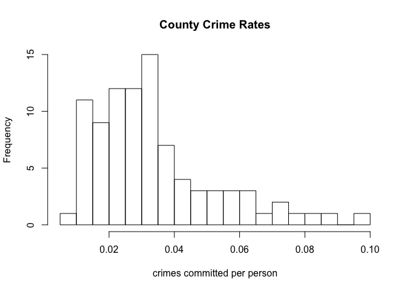

### Observations:

***crime***: The histogram shows a positive skew. Because of the positive skew, we will do a log transformation of this variable. We confirmed that this variable has no values less than or equal to zero.

*Criminal justice variables*$\\\\$ We then take a look at other key criminal justice variables.

``` r
hist(police, breaks = 20, main = "Police Per Capita",
     xlab = "police per capita")
```

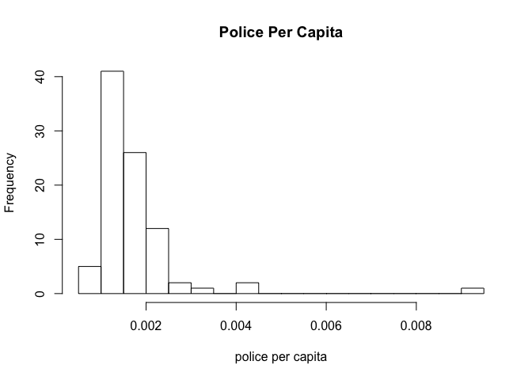

``` r
hist(probarr, breaks = 16, 
     main = "Proportion of County Crimes Resulting in Arrests",
     xlab = "Proportion of Crimes Resulting in Arrests")
```

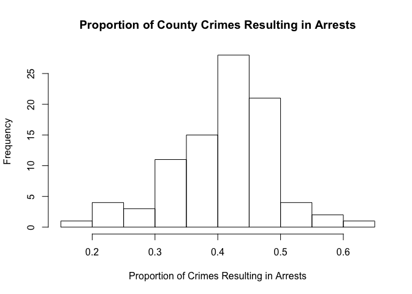

``` r
hist(probconv, breaks = 10, main = "Proportion Being Convicted After Arrest",
     xlab = "Proportion")
```

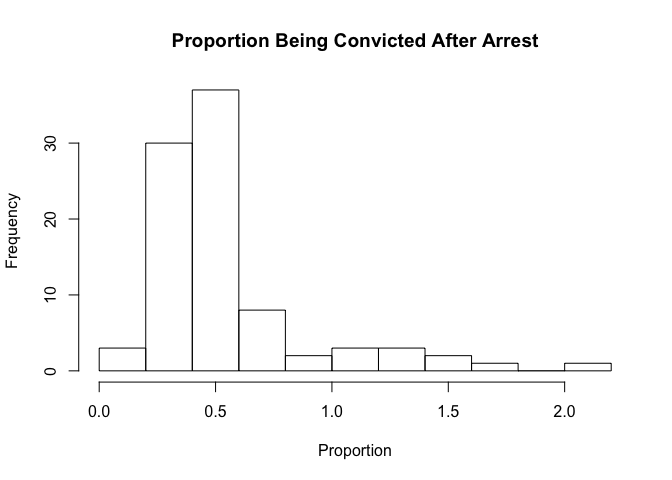

``` r
hist(probsen, breaks = 20, main = "Proportion Being Sentenced After Conviction",
     xlab = "Proportion")
```

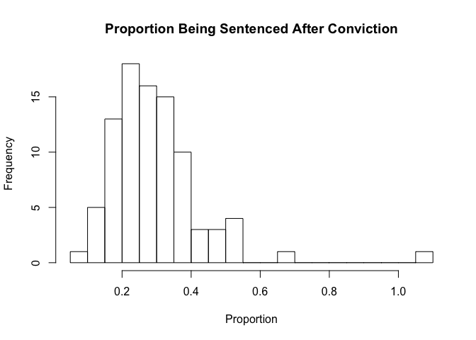

``` r
hist(mix, breaks = 20, main = "Ratio of Face-to-Face/All Other Crime",
     xlab = "Ratio")
```

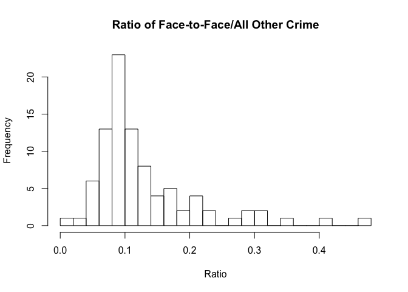

### Observations:

***police***: The histogram shows a positive skew. We have one outlier which is county 115. Police per capita should have negative influence on county crime rates, since police presence is generally thought of as a deterence. We consider a log transformation of this variable. $\\\\$ ***probarr***: The histogram shows a slight negative skew. This variable is likely to be correlated to police since more police will lead to more arrests and vice versa. $\\\\$ ***probsen***: The histogram shows a slight positive skew. Also, presence of two outliers is noted. We see a probability value of greater than 1. Interestingly, this belongs to county 115, the same county which has the police outlier. $\\\\$ ***probconv***: The histogram shows a high positive skew. We see a probability value of greater than 1 for ten counties. We note an outlier with value 2.12 in county 185. This county also has an extreme outlier in *wageser* of $2177.06. We lack a solid reason to believe these values are erroneous, so we will include them in our analysis. $\\\\$ ***mix***: The histogram shows a high positive skew. $\\\\$ ***avgsen***: From the initial summary, due to the low number of maximum days, we think that this variable is unlikely to deter crime. $\\\\$

*Economic variables*$\\\\$ Wage would be a good economic indicator, but in our dataset wage is broken up into eight different variables based on sector. In the absence of sector weights, it is impossible to create a meaningful average variable. We tried various ways to interpret the given information by taking an average of all the wage variables and also by taking the wage range in each county to understand wage effect on crime. However, we cannot conclude that these are meaningful variables for our analysis. We look at the other economic variable, *tax*, below.

``` r
hist(tax, breaks = 20, main = "Tax Revenue Per Capita",
     xlab = "Tax")
```

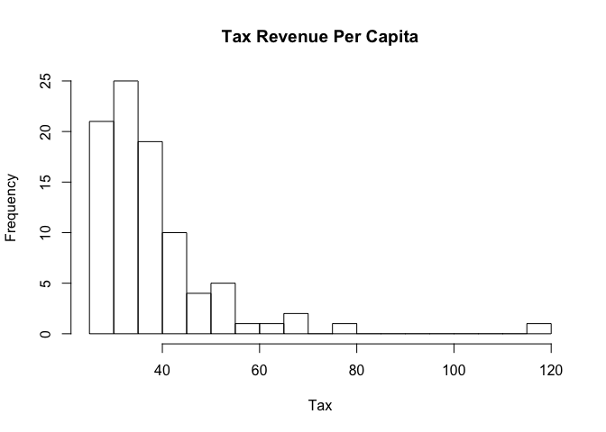

### Observations:

***tax***: Tax revenue per capita is a good indicator of the financial health of a county. The histogram shows a positive skew. Also, presence of an outlier is noted which is county 55. We did not find anything noteworthy in this county.

*Demographic variables*$\\\\$ Lastly, we assess the demographic variables.

``` r
hist(density, breaks = 20, main = "Density",
     xlab = "people per square mile")
```

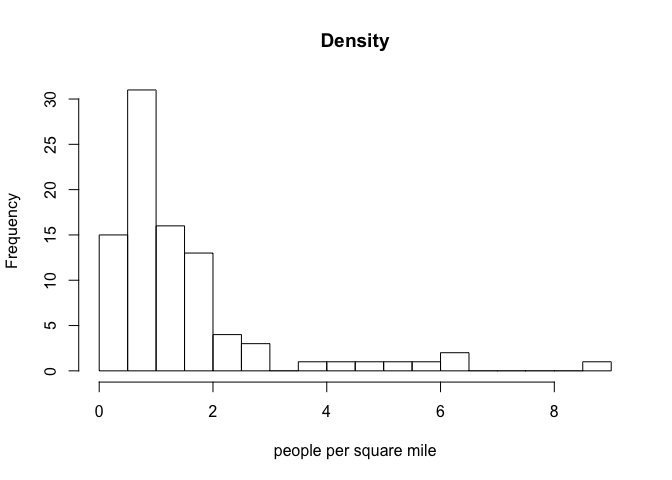

``` r
hist(ymale, breaks = 20, main = "Propotion of County Males Between 15 And 24 years.",
     xlab = "Proportion")
```

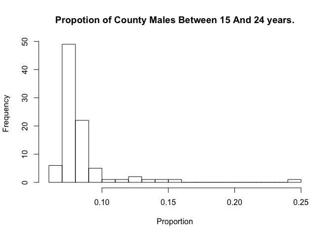

``` r
hist(pctmin, breaks = 20, main = "Proportion of Minority or Nonwhite",
     xlab = "Proportion")
```

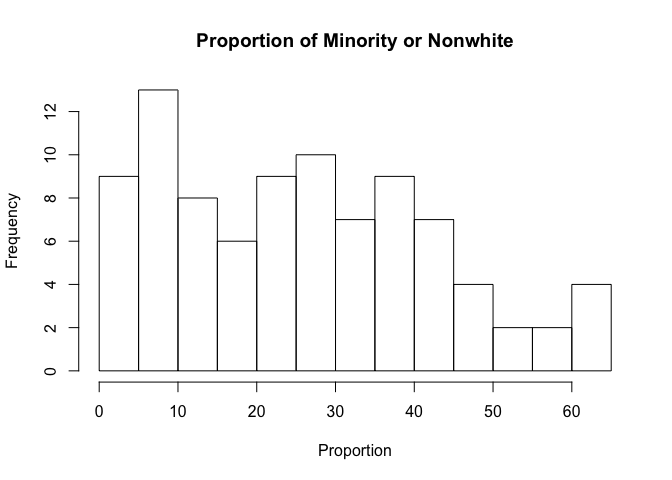

### Observations:

***density***: The histogram has a strong positive skew, reflecting a few urban areas in the state. As mentioned before, the maximum density is only eight people per square mile. $\\\\$ ***ymale***: This histogram also has a strong positive skew. It has an outlier in county 133. We did not find anything worth noting in this county.$\\\\$ ***pct\_min***: The histogram has somewhat of a uniform distribution with a decrease on the right end. $\\\\$

*Indicator variables*$\\\\$ ***urban***: We have 8 counties in this region. Since this variable is highly related to density, we will utilize *density* as it contains more detailed information than *urban*. $\\\\$ ***west***: There are 34 counties that belong to West region.$\\\\$ ***central***: 21 counties fall in this region.

**Variable Transformations**$\\\\$ The common way to report crimes is per 1000 people, so we will scale it here for readability. To make police consistent with *crime*, we scale *police* as well. Following the first stage of data analysis, we perform log transformations of crime and density, and plot their histograms.

``` r
scaledcrime = crime*1000
scaledpolice = police*1000
hist(log(scaledcrime), main="Log of Crime per 1000 people", xlab=NULL, breaks=20)
```

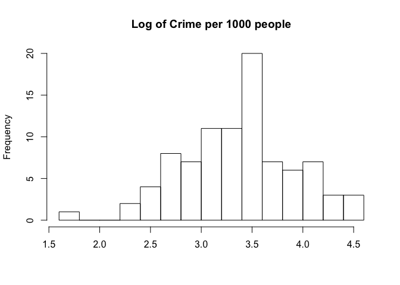

``` r
hist(log(density), main="Log of Density", xlab=NULL, breaks=20)
```

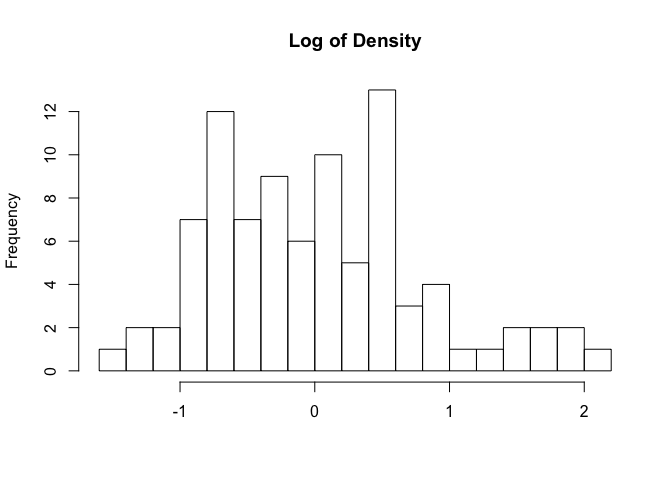

### Observations:

***log(scaledcrime)***: The log transformation has made the distribution quite normal. This will help ensure that the errors of the model are normal (i.e. CLM assumption 6).$\\\\$ ***log(density)***: The log transformation of density has helped with the normalty of the distribution as well. $\\\\$

Correlations
------------

We examine the relationship between crime rate and potentially deterrent criminal justice variables. As mentioned before, *police* and *probarr* are likely to be highly correlated, since police are the ones making arrests, so we include only one out of the two. *mix* most likely has an associative relationship to crime and will not be a deterrent, so we exclude it from our search for key variables for policy recommendations.

``` r
scatterplotMatrix(~ log(scaledcrime) + log(scaledpolice) + probconv + probsen)
```

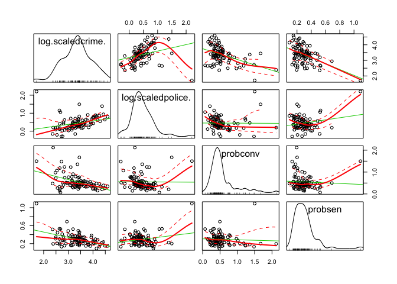

### Observations:

Contrary to our expectations, we see a positive relationship between *log(scaledpolice)* and *log(scaledcrime)*. This suggests that police may be the result of high crime rate rather than a cause of low crime rate. Therefore, it will not be a key variable of interest. Both *probsen* and *probconv* have the expected negative relationship with crime rate, meaning that they are potentially deterrent factors.

``` r
scatterplotMatrix(~ log(scaledcrime) + log(density) + pctmin + log(ymale) + log(tax))
```

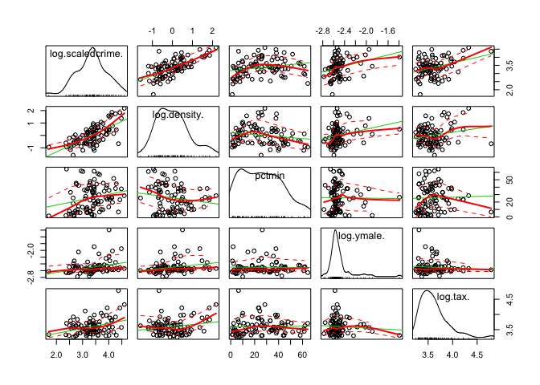

### Observations:

We see a strong positive relationship between *log(density)* and *log(scaledcrime)*, which is consistent with the common notion of high crime rates in urban areas. The association between *pctmin* and *log(scaledcrime)* is less clear, with an initial rise, then a reduction as *pctmin* increases on the x-axis. Even after the log transformation, *log(ymale)* still has a high positive skew and therefore too much clustering to make sense of the relationship with crime rate. The same is true for *log(tax)*. Since there is no improvement, *ymale* and *tax* will remain untransformed in the models.

Furthermore, we expected to see a negative relationship with **tax revenue per capita** as a proxy for income levels. Since it's positive, we rule out *tax* as a key variable of interest as it relates to reducing crime rates.

Model 1 Building and Assumption Testing
---------------------------------------

Based on the exploratory data analysis and underlying intuition about crime relationships, our initial proposed model specification and coefficient expectations are:$\\\\$ ***log(density)***: since this variable shows the strongest linear relationship with *log(scaledcrime)* and is consistent across its range, we include this as an associative variable to avoid significant omitted variable bias in our key variables of interest.$\\\\$ ***probconv***: our intuition that an increase in conviction helps reduce crime rate is supported by the scatterplot in our EDA. While *probsen* showed a negative relationship with *crime* in the scatterplot analysis, it is not likely to be key deterrent as the maximum average length of sentencing is so low (20 days).

``` r
model1 = lm(log(scaledcrime) ~ probconv + log(density))
```

### Testing the validity of the 6 assumptions of the CLM

**CLM 1 - A linear model**: The model is specified such that the dependent variable is a linear function of the explanatory variables. $\\\\$ Is the assumption valid? Yes.$\\\\$ Response: No response required.

**CLM 2 - Random Sampling**: Given that we have a dataset of 90 counties from an unknown location, and we do not know how the data was collected and if the data collection was consistent among the counties, this assumption is uncertain. Additionally the structure of one observation representing each county further confounds the assumption of randomly observed variables. A true random sample would take observations at random from the unaggregated level. $\\\\$ Is the assumption valid? Not clear.$\\\\$ Response: We proceed with the analysis.

**CLM 3 - Multicollinearity**: As a quick test of the multicollinearity condition, we check the correlation of the two explanatory variables and their variance inflation factors (VIFs):

``` r
CrDat$logdensity = log(density)
X = data.matrix(subset(CrDat, select=c(logdensity, probconv)))
cor(X)
```

    ##            logdensity   probconv
    ## logdensity  1.0000000 -0.2346289
    ## probconv   -0.2346289  1.0000000

``` r
vif(model1)
```

    ##     probconv log(density) 
    ##     1.058258     1.058258

The two explanatory variables are not perfectly correlated and the VIFs are low (i.e. less than 4), so there is no perfect multicollinearity of the independent variables.$\\\\$ Is the assumption valid? Yes $\\\\$ Response: No response required.

**CLM 4 - Zero-Conditional Mean**: To analyze whether there is a zero-conditional mean of the residuals across the explanatory variables in model 1, we plot the residuals against the fitted values with the predicted conditional mean spline line across fitted values.

``` r
plot(model1, which=1)
```

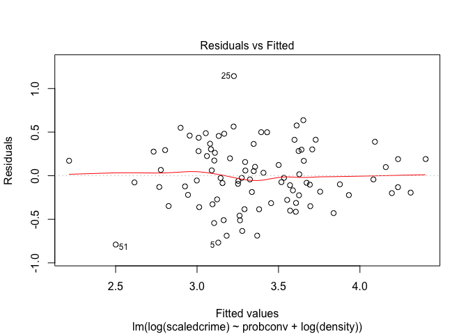

The plot indicates little evidence that the zero-conditional mean assumption doesn't hold. The red spline line on the residuals versus fitted values plot is fairly flat.$\\\\$ Is the assumption valid? Yes$\\\\$ Response: No response required

**CLM 5 - Homoscedasticity**: To determine whether the variance of the error is fixed for all model 1 explanatory variables, we view the scale-location plot.

``` r
plot(model1, which = 3)
```

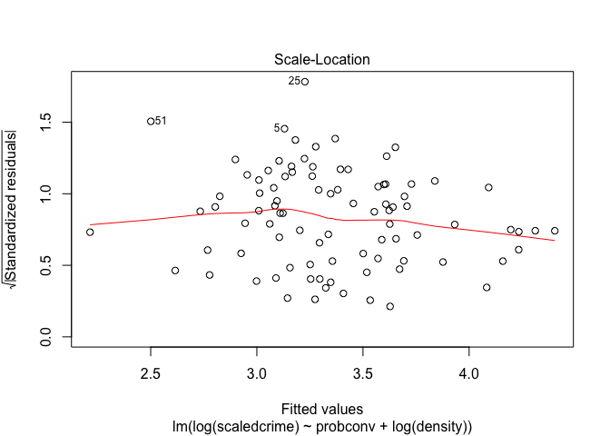

``` r
bptest(model1)
```

    ## 
    ##  studentized Breusch-Pagan test
    ## 
    ## data:  model1
    ## BP = 8.1949, df = 2, p-value = 0.01661

The scale-location plot shows some evidence of heteroskedasticity, as seen by the red spline line curvature. The Breusch-Pagan shows a rejection of the null hyposthesis of homoskedasticity, with a p-value less than *α* = 0.05.

Is the assumption valid? No.$\\\\$ Response: Use robust standard errors.

**CLM 6 - Normality of residuals**: To determine whether there is normality of the residuals we use a Q-Q plot of the residuals and simply visually observe whether there is normality.

``` r
plot(model1, which = 2)
```

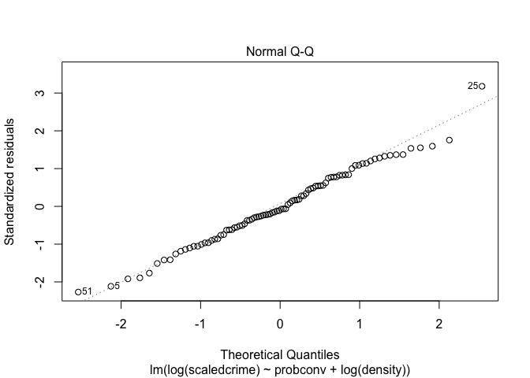

The Q-Q plot shows deviation from normality on the positive end.

Is the assumption valid? No.$\\\\$ Response: Despite the distribution of model 1 residuals showing non-normality, since we have a large sample size of 90, we can rely on the central limit theorem to satisfy this assumption.

Model 2 Building and Assumption Testing
---------------------------------------

Building on our initial model, we include variables that are associative but less likely to introduce bias.$\\\\$ ***probsen***: An increase in sentencing rates is associated wth a reduction in crime rate as seen from the scatterplot in our EDA.$\\\\$ ***pctmin***:In real world, poverty, minority population and crime rates are interlinked. We include *pctmin* in our model in lieu of an economic indicator for low income communites.

``` r
model2 = lm(log(scaledcrime) ~ probconv + log(density)+ probsen +pctmin)
AIC2 = AIC(model2)
plot(model2)
```

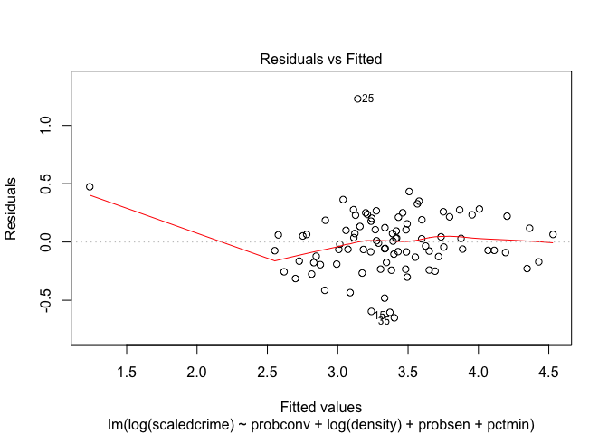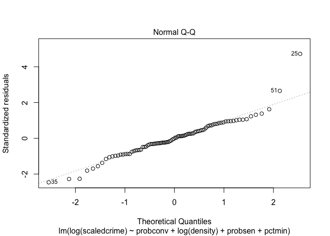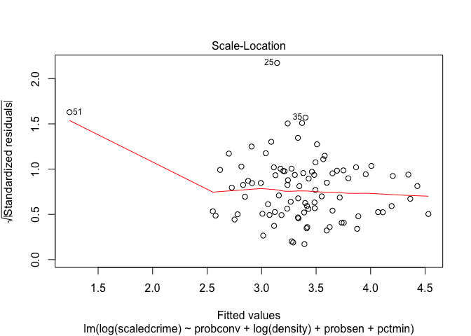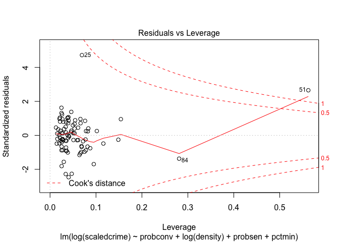

**Noting CLM assumption differences from Model 1**$\\\\$ The Q-Q plot shows deviation from normality on both the negative end and the positive end. So we continue to rely on the Central Limit Theorem as the number of observations is 90.

The zero conditional mean assumption holds except for the left end of the plot where we have only one data point. The Scale-Location plot shows reduced evidence of heteroskedasticity. So we continue to use robust standard errors. The residual vs. leverage plot has one data point with a cook's distance above 1. The lone point is county 51, which is the only one with a probability of sentencing above 1.

``` r
detach(CrDat)
CrDat1 <- CrDat[-c(51),]
attach(CrDat1)
```

    ## The following object is masked _by_ .GlobalEnv:
    ## 
    ##     X

``` r
model2_alt = lm(log(crime) ~ probconv + log(density) + probsen + pctmin)
plot(model2_alt, which = 1)
```

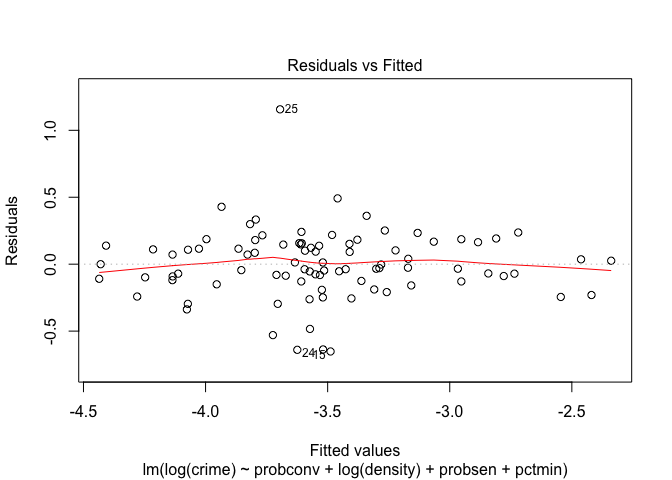

``` r
detach(CrDat1)
```

When we ran the model after removing county 51, zero conditional mean and homoskedasticity assumptions hold and the model estimates do not change significantly. We are keeping county 51 in our model as this data point not likely to be erroneous.

``` r
vif(model2)
```

    ##     probconv log(density)      probsen       pctmin 
    ##     1.087560     1.303723     1.206486     1.031430

The variance inflation factors for the variables are all less than 4, indicating an acceptable level of multicollinearity between them.

Model 3 Building and Assumption Testing
---------------------------------------

In this model, we include the remaining variables excluding *police* and the 9 wage variables. As previously mentioned, we believe police per capita is an outcome of the crime rate since they are positively related. We are unable to create a meaningful wage variable without employment information to combine the sector wage variables into a weighted average.

``` r
attach(CrDat)
```

    ## The following object is masked _by_ .GlobalEnv:
    ## 
    ##     X

``` r
model3 = lm(log(scaledcrime) ~ probconv + probsen +  log(density) + pctmin +
                    probarr + ymale + avgsen +  mix  + central + west + tax)
plot(model3)
```

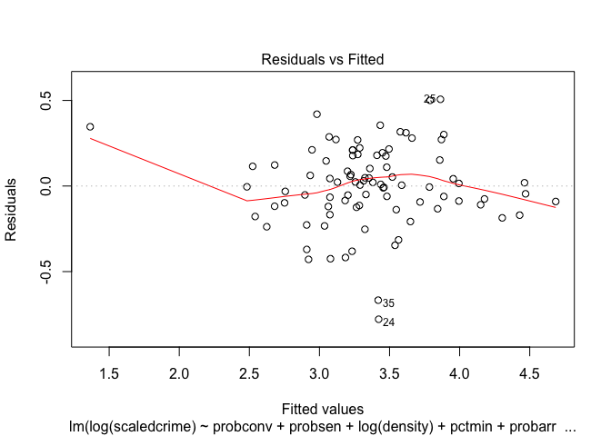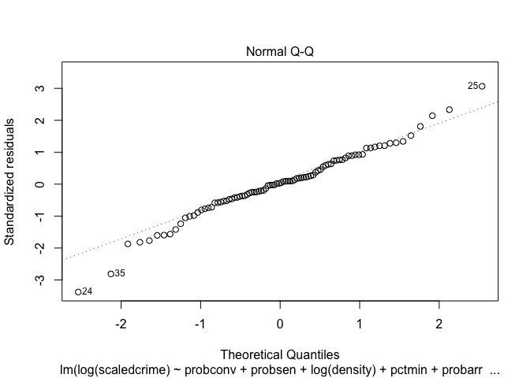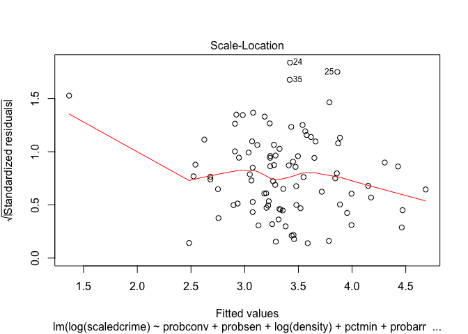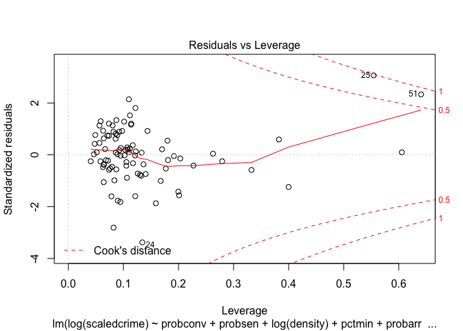

``` r
vif(model3)
```

    ##     probconv      probsen log(density)       pctmin      probarr 
    ##     1.432342     1.550411     1.808691     2.662238     1.111375 
    ##        ymale       avgsen          mix      central         west 
    ##     1.191155     1.285332     1.567344     3.146106     1.998869 
    ##          tax 
    ##     1.173671

**Noting CLM assumption differences from Model 2**$\\\\$

Once again, the zero conditional mean assumption holds except for the left end of the plot where we have only one data point. The Scale-Location plot shows greater heteroskedasticity than model 2. So we continue to use robust standard errors. The influence of county 51 on the model has reduced (Cook's distance &lt; 1) as seen in the residual vs. leverage plot.

The Q-Q plot shows deviation from normality on both the negative end and the positive end. So we continue to rely on the Central Limit Theorem.

The variance inflation factors for the variables are all less than 4, indicating an acceptable level of multicollinearity between them.

Comparison of Models
====================

The results of the three models are reported in the table below.

``` r
# Compute Akaike information criterion (AIC)
AIC1 = AIC(model1)
AIC2 = AIC(model2)
AIC3 = AIC(model3)

# Adjust standard errors
cov1 = vcovHC(model1)
robust_se1 = sqrt(diag(cov1))
cov2 = vcovHC(model2)
robust_se2 = sqrt(diag(cov2))
cov3 = vcovHC(model3)
robust_se3 = sqrt(diag(cov3))

# Adjust F statistic
wald_results <- waldtest(model1, vcov = cov1)

stargazer(model1, model2, model3, type = 'text', intercept.bottom = FALSE,
          se        = list(robust_se1, robust_se2, robust_se3),
          omit.stat = "f",
          add.lines = list(c("AIC", round(AIC1, 2), round(AIC2, 2),
                             round(AIC3, 2))))
```

    ## 
    ## ===================================================================
    ##                                   Dependent variable:              
    ##                     -----------------------------------------------
    ##                                    log(scaledcrime)                
    ##                           (1)             (2)             (3)      
    ## -------------------------------------------------------------------
    ## Constant               3.616***        3.707***        3.280***    
    ##                         (0.089)         (0.253)         (0.424)    
    ##                                                                    
    ## probconv               -0.466***       -0.550***       -0.497***   
    ##                         (0.133)         (0.163)         (0.140)    
    ##                                                                    
    ## log(density)           0.436***        0.392***        0.381***    
    ##                         (0.049)         (0.059)         (0.074)    
    ##                                                                    
    ## probsen                                 -1.179*         -1.058*    
    ##                                         (0.637)         (0.574)    
    ##                                                                    
    ## pctmin                                 0.012***        0.010***    
    ##                                         (0.002)         (0.003)    
    ##                                                                    
    ## probarr                                                  0.019     
    ##                                                         (0.378)    
    ##                                                                    
    ## ymale                                                   1.681**    
    ##                                                         (0.806)    
    ##                                                                    
    ## avgsen                                                   0.006     
    ##                                                         (0.014)    
    ##                                                                    
    ## mix                                                      0.007     
    ##                                                         (0.524)    
    ##                                                                    
    ## central                                                 -0.127     
    ##                                                         (0.131)    
    ##                                                                    
    ## west                                                    -0.129     
    ##                                                         (0.089)    
    ##                                                                    
    ## tax                                                      0.008     
    ##                                                         (0.006)    
    ##                                                                    
    ## -------------------------------------------------------------------
    ## AIC                      79.58           26.22           17.27     
    ## Observations              90              90              90       
    ## R2                       0.564           0.770           0.822     
    ## Adjusted R2              0.554           0.759           0.796     
    ## Residual Std. Error 0.366 (df = 87) 0.269 (df = 85) 0.248 (df = 78)
    ## ===================================================================
    ## Note:                                   *p<0.1; **p<0.05; ***p<0.01

**Statistical Significance**$\\\\$ All independent variables are statistically significant in model 1. Three variables are statistically significant in model 2 at a significance level of 0.01. The variable *probsen* is not statistically significant at *α* = 0.05 but is significant at *α* = 0.1. The variable *ymale* is also significant at *α* = 0.05 in model 3. *ymale* was not significant when included along with model 2. This makes us think it was biased by omitted variables like *mix* or *probarr*.

**Goodness of Fit**$\\\\$

The *R*<sup>2</sup> values goes up as we move from Model 1 to Model 3 as expected with the addition of more variales. The AIC values decrease by 67% from Model 1 to Model 2 and by 34% from Model 2 to Model 3. This shows that Model 2 has better accuracy and goodness of fit compared to Model 1. The smaller decrease in AIC from Model 2 to Model 3 comes at the price of adding seven more variables. The slope coefficients of the indepedent variables did not change much between Model 2 and Model 3 showing the robustness of Model 2. Therefore **Model 2 is our best linear model balancing accuracy and parsimony**.

**Coefficient Interpretations and Practical Significance of Model 2**$\\\\$ The results shows that a 0.1 unit increase in proportion of conviction is associated with a decrease in crime per 1000 people of 5.3% ((*e*<sup>−0.055</sup> − 1)\*100) ( *probconv* is reported between 0 and 2.2 in our dataset). This is a substantial decrease in crime rate. $\\\\$ For every 1% increase in density, the crime per 1000 people go up by approximatley 0.39%. This change is not insignificant $\\\\$ A 0.1 unit increase in proportion of sentencing is associated with a decrease in crime per 1000 people of 11.1% ( *probsen* is reported between 0 and 1.09 in our dataset). This represents a large effect size. $\\\\$ Finally a 1 percentage point increase in percentage of minorities is associated with a increase in crime per 1000 people of 1.2%. The reasoning behind this is not clear but is likely a reflection of low income. We revisit this topic under causality later.

Thus all four variables in model 2 have practical significance.

Causality
=========

It is tempting to claim model 2 to be a causal model, with *probconv* being the strongest causal factor in reducing crime rate. However such a claim would be misleading, given that assurring causality would require us to manipulate the causal variable while keeping all of the other variables constant, which is not possible in the real world. Alternatively, a randomly controlled trial would not be possible on such a large scale. Also, it is well known that low income is highly associated with and likely causally related to crime. This information is omitted from our model. Perhaps recording data before and after a policy change to see how crime rates are affected would enable us to make some stronger causal claims. However without a controlled experiment, there would still be significant uncertainity.

**Omitted Variable Bias** The absence of good economic variables leaves open to question our estimates, since they are well known factors assoicated with crime rate. For example, income levels are not present in our model and probably bias our key variable *probconv*, since income level determines the quality and amount of legal representation available for court. Income level probably has a negative correlation with *probconv* and a negative correlation with *crime* leading to an upward bias for coefficient of *probconv*.

Because of the manner in which population density influences living conditions (ie: houses vs. apartment complexes), density is also likely to be correlated with both poverty and crime. More densely populated neighborhoods tend to be poorer. Since our dataset does not provide us good information on income level in each county or unemployment rate in each county, coefficient for density has an omitted variable bias. Since poverty level probably has a high positive correlation with density as well as crime, the coefficient of density has an upward bias.

Recommendations
===============

Our analysis highlights *probconv* and *probsen* as strong deterrences of crime. The campaign should use this analysis to propose actions that can reduce the crime rate, like police and investigation training to improve court case outcomes, as well as better prosecution (e.g. lawyer training, reduction in prosecutor caseloads) to increase conviction rates. To increase the probability of sentencing, laws also can be expanded to include mandatory sentencing for certain crimes.

Conclusion
==========

We started with a detailed exploratory analysis of the dataset to identify strong candidates as inputs to our models. We developed three models, starting with the strongest variables associated with crime rate, and checked whether the Classical Linear Model assumptions were satisfied. We then developed three multiple regression models to describe crime rate and its associated factors. We compared the relative qualities of the models, balancing accuracy with parsimony. We identified four variables, in our 2nd model, that are best associated with crime rates - probability of conviction, probability of sentencing, density and proportion of minority or nonwhite. Each association with crime was in the expected direction. However, more data on economic factors will improve the model and reduce bias. We tried to utilize wages given for different sectors of the economy, but without knowing the proportions of each sector, an average wage would be misleading. We also tried to use tax revenue per captita as a proxy for income disparity, but the direction of its relation to crime rate was opposite of our expectation. We commented on the deficiencies in claiming causality of our key variables. Despite not claiming causality, we still recommended that policy focuses on reducing the proportion of arrests resulting in convictions, as well as the proportion of convictions resulting in sentences, since they were found to have strong negative associations with crime rate. Although this analysis provides an interesting outlook on the relationship between crime and several key variables, it has a few shortcomings. The small scope of this examination yields a lack of some key independent variables and results omitted variable bias.
